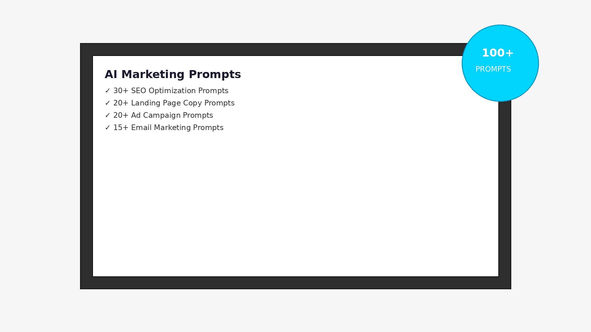
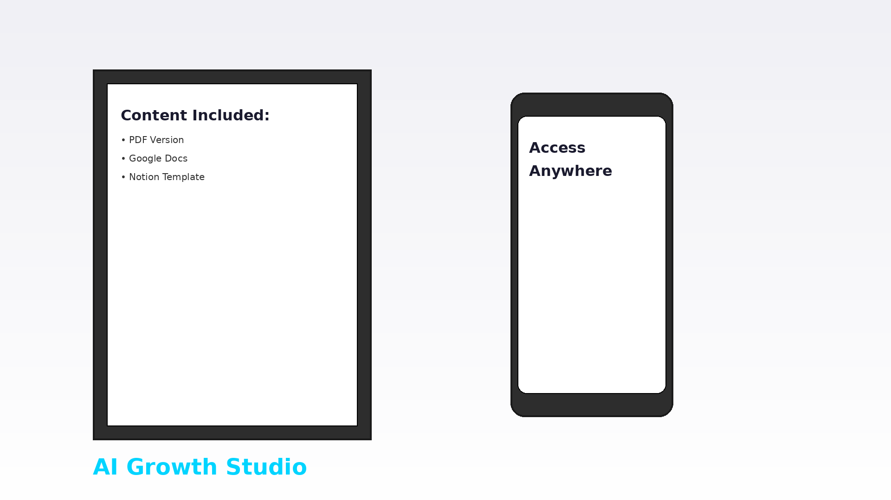

# AI Marketing & SEO Prompt Master Pack

**Premium AI Prompts for Marketing, SEO & Sales Professionals**

*By AI Growth Studio · MHM IT*

## Overview

The AI Marketing & SEO Prompt Master Pack is a comprehensive collection of expertly crafted prompts designed to supercharge your marketing workflows using AI tools like ChatGPT, Claude, and other language models. This pack contains battle-tested prompts that deliver professional-grade outputs for content creation, SEO optimization, sales copy, conversion rate optimization, and strategic marketing planning.

**Transform your marketing operations with AI-powered efficiency—all for just $29.**

## What's Included

### Content & Strategy
- **Content Planning & Strategy** - Generate content calendars, editorial plans, and strategic content frameworks
- **Blog Post Creation** - Craft engaging, SEO-optimized blog posts and articles
- **Social Media Content** - Create compelling posts for all major social platforms
- **Email Marketing** - Design high-converting email sequences and newsletters
- **Video Scripts** - Develop engaging scripts for YouTube, TikTok, and promotional videos

### SEO Optimization
- **Keyword Research** - Discover high-value keywords and search opportunities
- **Meta Descriptions & Titles** - Create click-worthy meta tags that improve CTR
- **SEO Content Briefs** - Generate comprehensive content briefs for writers
- **Technical SEO Audits** - Identify and fix technical SEO issues
- **Local SEO Optimization** - Optimize for local search visibility

### Sales & Conversion
- **Sales Copy** - Write persuasive landing pages, sales letters, and product descriptions
- **Ad Copy Creation** - Craft high-performing ads for Google, Facebook, LinkedIn, and more
- **Call-to-Action Development** - Design compelling CTAs that drive conversions
- **Value Propositions** - Articulate unique selling points and competitive advantages
- **Customer Testimonials** - Transform feedback into powerful social proof

### Analytics & Insights
- **Competitor Analysis** - Analyze competitor strategies and identify opportunities
- **Market Research** - Conduct audience research and market analysis
- **Performance Reporting** - Generate actionable insights from marketing data
- **A/B Testing Ideas** - Develop hypotheses and testing frameworks
- **CRO Audits** - Conversion rate optimization and funnel analysis

### Brand Voice & Style
- **Tone of Voice Presets** - Create consistent brand messaging across all channels
- **Style Guide Development** - Define your unique communication style

## Who Is This For?

- **Digital Marketers** - Streamline content creation and campaign planning
- **SEO Specialists** - Enhance optimization workflows and strategy development
- **Content Creators** - Produce high-quality content faster and more consistently
- **Business Owners** - Create professional marketing materials without a large team
- **Marketing Agencies** - Scale content production for multiple clients
- **Freelancers** - Deliver exceptional results more efficiently

## Why Choose This Pack?

✅ **Time-Saving** - Reduce content creation time by up to 70%  
✅ **Professional Quality** - Prompts designed by marketing experts for expert-level outputs  
✅ **Versatile** - Works with ChatGPT, Claude, and other AI language models  
✅ **Proven Results** - Battle-tested prompts used in real marketing campaigns  
✅ **Easy to Use** - Clear instructions and examples for each prompt  
✅ **Regular Updates** - Continuously refined based on latest AI capabilities

## Getting Started

1. Browse the `content/` folder to find prompts organized by category
2. Copy the prompt you need
3. Customize the bracketed placeholders with your specific information
4. Paste into your preferred AI tool (ChatGPT, Claude, etc.)
5. Review and refine the output to match your brand voice

## Structure

```
├── README.md                    # This file
├── LICENSE                      # MIT License
├── content/
│   └── english.md              # Complete prompt collection (35+ pages)
├── docs/
│   └── landing-page.md         # Product sales copy
└── assets/
    ├── cover.png               # Product cover image
    ├── mockup1.png             # Product mockup 1
    └── mockup2.png             # Product mockup 2
```

## Preview

### Product Overview


The AI Marketing & SEO Prompt Master Pack includes professionally designed templates and frameworks ready to use immediately with your favorite AI tools.

### What You'll Get



*35+ pages of comprehensive prompts covering every aspect of digital marketing*



*Organized by category for easy navigation and implementation*

## Best Practices

- **Customize** - Always adapt prompts to your specific brand voice and requirements
- **Iterate** - Don't settle for the first output; refine and regenerate as needed
- **Combine** - Mix and match prompts for comprehensive marketing solutions
- **Learn** - Study the prompt structures to improve your own AI interactions
- **Test** - A/B test AI-generated content against your traditional approaches

## Get Started Today

**Ready to transform your marketing with AI?**

🚀 [**Purchase on Gumroad - Only $29**](#) *(Link to be added after launch)*

Get instant access to all prompts and start creating professional marketing content in minutes.

## Remaining Tasks

The following items are planned for future updates:

- [ ] Replace placeholder images with branded mockups
- [ ] Add Google Docs version for easy cloud access
- [ ] Add Notion version for team collaboration
- [ ] Upload final PDF version
- [ ] Add active Gumroad purchase link

## Support & Updates

This is a living product that evolves with AI capabilities and marketing best practices. Feedback and suggestions are welcome to make this resource even more valuable for the marketing community.

**Contact us:** info@mhmit.nl

## License

This product is provided under the MIT License. For personal and commercial use. Please do not redistribute or resell this prompt pack.

---

**AI Growth Studio · MHM IT**  
*Start creating exceptional marketing content with AI today!*
